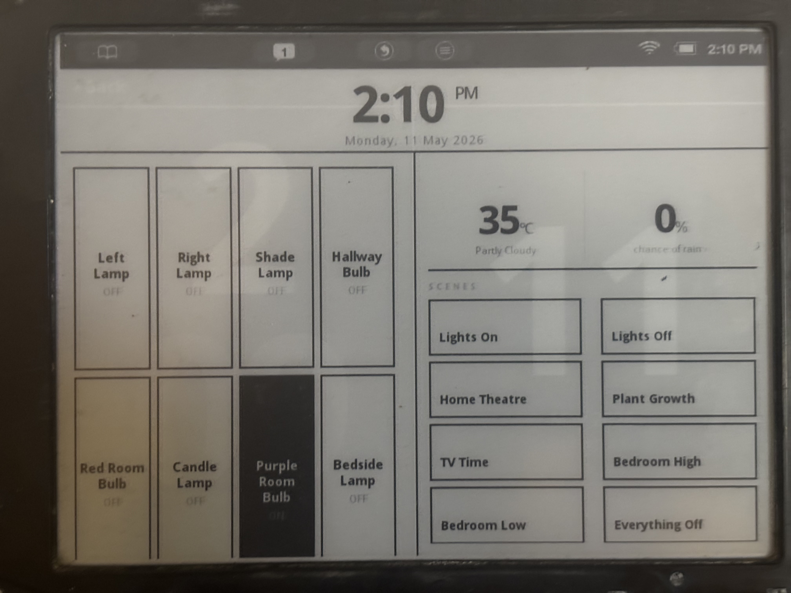
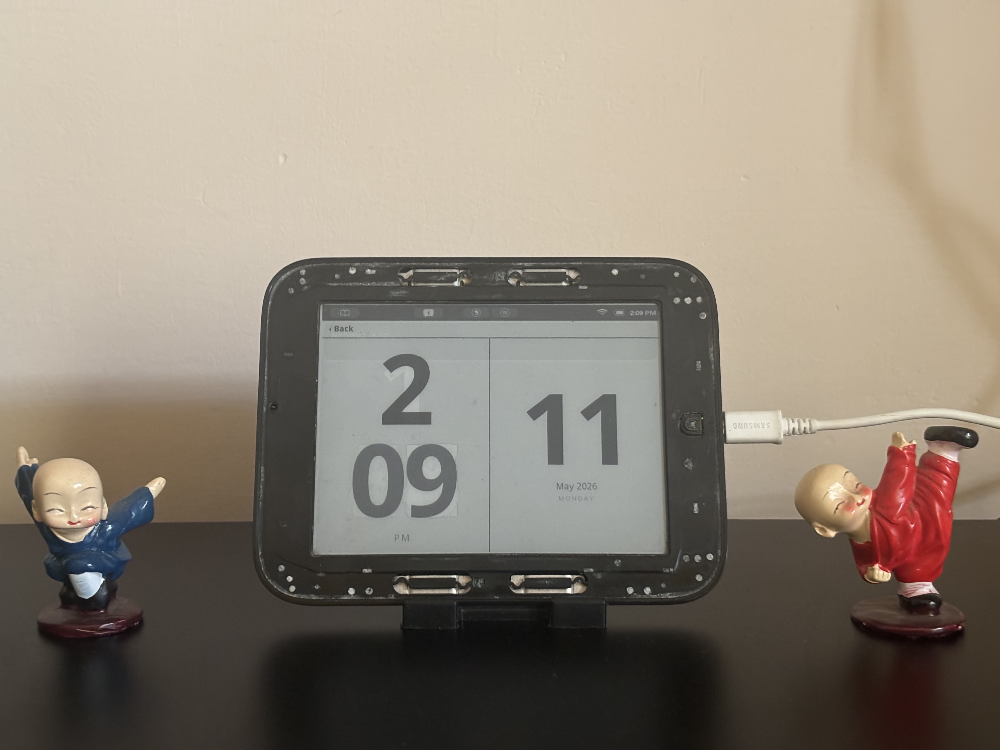
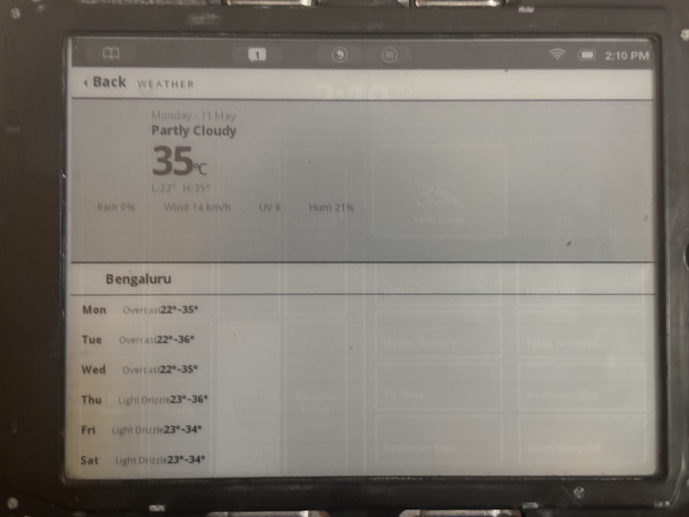
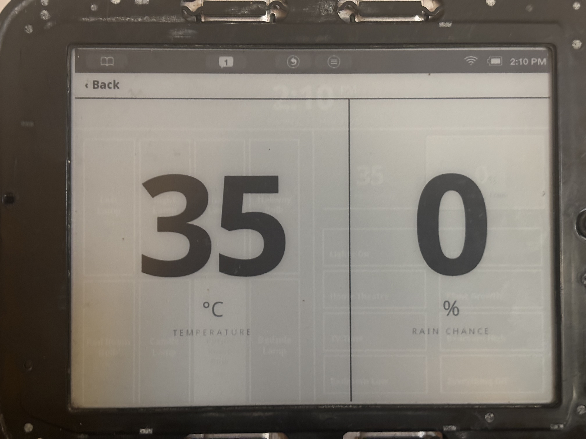
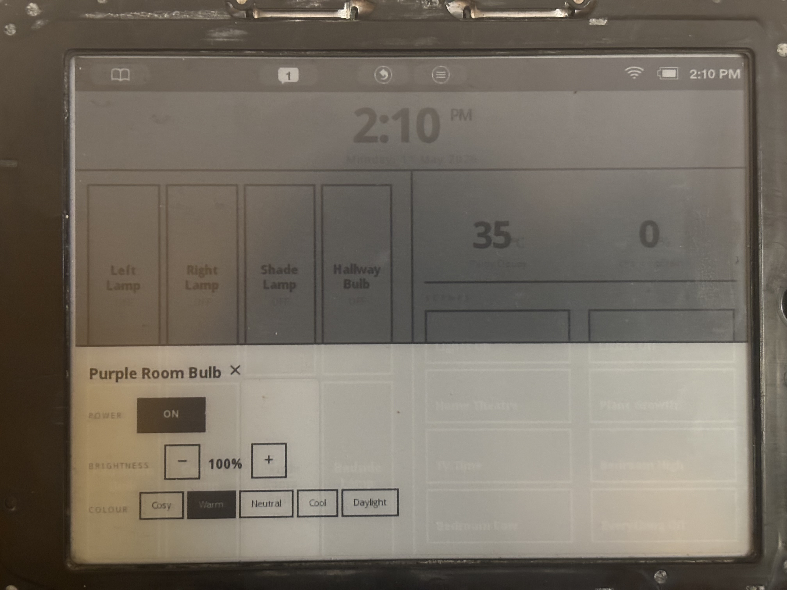

# Nook Dashboard

A lightweight smart home dashboard for the **Barnes & Noble Nook Simple Touch (BNRV300)** — an e-ink Android 2.1 device repurposed as a wall-mounted home control panel. Controls WiZ smart bulbs over local UDP, shows live weather, and runs entirely on a Raspberry Pi Zero 2W with no cloud dependency.

---

## Screenshots

**Home screen** — clock, device tiles, weather summary and scenes at a glance



---

**Fullscreen clock** — tap the clock on the home screen to expand; hours and minutes fill the panel with date on the right



---

**Weather detail** — tap the weather panel for full conditions, UV, wind, humidity and a 7-day forecast



---

**Fullscreen weather** — tap temperature or rain % to expand a single stat edge-to-edge



---

**Device drawer** — tap any device tile to slide up per-bulb controls: power, brightness and colour temperature presets



---

## First: root your Nook with NookManager

This project requires a rooted Nook. The easiest way is **NookManager** — a graphical one-click rooter created by **[@jeff_kz](https://xdaforums.com/m/jeff_kz.4764553/)** on XDA Developers.

- **NookManager (original thread, fw 1.2.x and beyond)** by jeff_kz:
  https://xdaforums.com/t/root-nookmanager-graphical-rooter-for-1-2-x-and-beyond.2040351/

- **Updated image for fw 1.2.2** by **[@nmyshkin](https://xdaforums.com/m/nmyshkin.1375/)** (same instructions, replace the image):
  https://xdaforums.com/t/nst-g-updating-nookmanager-for-fw-1-2-2.3873048/#post-78286686

Full credit to both for keeping this ancient hardware alive and useful.

---

## What this is

Once rooted, the Nook makes a surprisingly good always-on home dashboard. E-ink draws near-zero power when the image is static, the screen is large enough to read across a room, and the hardware is nearly free second-hand.

This project gives you:

- **Clock & date** — tap to expand fullscreen
- **Live weather** — current conditions + 7-day forecast via Open-Meteo (no API key needed), tap panels to expand
- **Device controls** — per-bulb on/off, brightness, colour temperature, RGB colour via a slide-up drawer
- **Scenes** — one-tap lighting presets
- **Fully local** — Pi sends UDP commands directly to WiZ bulbs; no WiZ cloud, no internet required for light control
- **Offline resilience** — if the server goes down, the dashboard automatically switches to the clock view (which keeps ticking client-side) and shows a SERVER OFFLINE badge until it reconnects

---

## Hardware

| Part | Notes |
|---|---|
| Nook Simple Touch BNRV300 | Android 2.1, 800×600 e-ink, rooted via NookManager |
| Raspberry Pi Zero 2W | Runs the Node.js server; any Pi or always-on machine works |
| WiZ smart bulbs | Any WiZ bulb reachable by local IP |

---

## Setup

### 1. Clone and configure

```bash
git clone https://github.com/paras-pathak/nook-dashboard.git
cd nook-dashboard
cp config.example.json config.json
```

Edit `config.json`:

- **`port`** — port for the server (default `3001`)
- **`location`** — your latitude/longitude and city name (used for weather only)
- **`devices`** — your WiZ bulbs with local IPs and MAC addresses
- **`scenes`** — lighting presets (see Scene commands below)

> **Finding bulb IPs:** WiZ app → bulb → Device Info, or check your router's DHCP table.
> Set **static DHCP leases by MAC address** in your router so IPs never change.

### 2. Run the server

**Option A — systemd (recommended, auto-starts on boot):**

```bash
# Copy and edit the service file
cp nook-dashboard.service /etc/systemd/system/nook-dashboard.service
nano /etc/systemd/system/nook-dashboard.service  # set User, WorkingDirectory, ExecStart
```

Find your node path first:
```bash
which node || which nodejs
# If installed via Homebridge: find /opt -name node -type f
```

Then enable and start:
```bash
sudo systemctl daemon-reload
sudo systemctl enable nook-dashboard
sudo systemctl start nook-dashboard
sudo systemctl status nook-dashboard
```

**Option B — manual:**
```bash
nohup node server.js > server.log 2>&1 &
```

Open `http://<your-pi-ip>:<port>` in a browser to confirm it works.

### 3. Open on the Nook

Navigate to `http://<your-pi-ip>:<port>` in the Nook's browser.

> Add `?v=1` to the URL (increment each time) if you need to force a cache refresh — the old WebKit caches aggressively.

---

## Keeping the Nook awake

The settings UI caps screen timeout at 1 hour. With ADB and root you can remove the limit entirely:

```bash
# Run once — takes effect immediately, no reboot needed
adb shell svc power stayon true
```

To survive reboots, write a `userinit.sh` (Android 2.1 executes this on boot if present):

```bash
printf '#!/system/bin/sh\nsvc power stayon true\n' > /tmp/userinit.sh
adb push /tmp/userinit.sh /data/local/userinit.sh
adb shell "su -c 'chmod 755 /data/local/userinit.sh'"
```

> **Note:** `svc power stayon` and `settings`/`sqlite3` commands are unavailable on stock Android 2.1 — `svc` is the only tool that works here without installing additional binaries.

---

## Scene commands

Each scene is a list of commands. Each command targets all devices, a room, or a specific bulb by MAC:

```json
{ "all": true, "state": false }
{ "room": "Living Room", "state": true, "dimming": 50, "temp": 3000 }
{ "mac": "AA:BB:CC:DD:EE:01", "state": true, "r": 180, "g": 0, "b": 180 }
```

| Field | Type | Description |
|---|---|---|
| `state` | boolean | on / off |
| `dimming` | 10–100 | brightness % |
| `temp` | 2200–6500 | colour temperature in Kelvin |
| `r` `g` `b` | 0–255 | RGB colour (overrides temp) |

---

## API

| Endpoint | Method | Description |
|---|---|---|
| `/api/state` | GET | Full state: weather, device states, config |
| `/api/device/:mac` | POST | Set bulb params (`state`, `dimming`, `temp`, `r`, `g`, `b`) |
| `/api/scene/:index` | POST | Trigger scene by index |
| `/api/admin/config` | POST | Save updated device/scene config |

---

## Hard-won Android 2.1 WebKit lessons

If you want to modify the frontend, these will save you hours:

- **No `display:flex`** — use `-webkit-box` with `-webkit-box-orient`, `-webkit-box-direction`, `-webkit-box-align`, `-webkit-box-pack`
- **No CSS Grid, no `gap`, no `inset`** — use floats and margins
- **Scroll drift** — `overflow:hidden` alone isn't enough; add `position:fixed` to `html,body`
- **`onclick` on large divs is unreliable** — always add a visible tappable back button; don't rely solely on tap-anywhere handlers
- **Aggressive caching** — the browser caches JS and HTML even with `Cache-Control: no-cache`; use versioned URLs (`?v=N`) on the Nook to force fresh loads
- **Timezone** — old Android reports UTC regardless of system timezone; correct it server-side by sending the Pi's UTC offset and recalculating in JS
- **Portrait on wake** — after sleep the browser sometimes resets to portrait; CSS `@media (orientation:portrait)` with `rotate(90deg)` and swapped `width`/`height` forces landscape back
- **Matter devices** — WiZ Matter bulbs still respond to direct UDP on local IP; no hub needed for basic on/off/dim/colour control

---

## License

MIT
